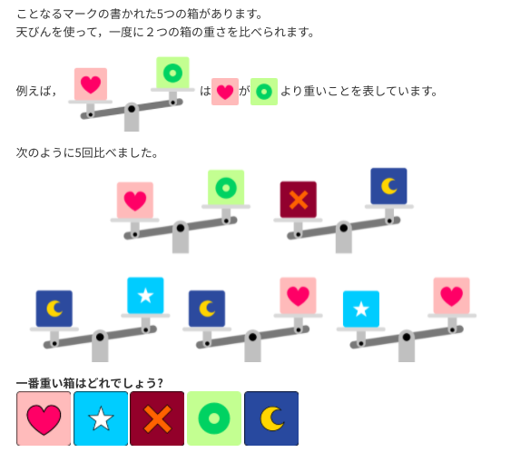

<route lang="yaml">
meta:
    title: 2022新歓イベントを開催します！
    layout: article
    postedAt: 2022-03-21
    lastUpdatedAt: 2022-04-02
    description:
        新入生歓迎イベントを2日間にわたって開催します。
        プログラミングの経験がない方も大歓迎です！
</route>

静岡大学プログラミングサークル SZPP です。

新入生の皆様、ご入学おめでとうございます🌸

このたび、SZPP の新入生歓迎イベントを開くことになりました。 \
プログラミングに少しでも興味のある人はぜひお越しください！ \
タイピング講座から始まるので、大学で初めてPCを使う方でも大歓迎です！

## 開催日時

- 第1日目：2022年04月16日(土) 13:30〜16:30 (13:00より受付開始)
- 第2日目：2022年04月17日(日) 13:30〜16:30 (13:00より受付開始)

## 開催場所
<s>情報学部1号館 J1601(J-SALOON)</s> \
<s>6階エレベーターを出て左にあります。</s>

情報学部1号館 J1501 \
5階エレベーターを出て左にあります。(2022-04-14 22:49 更新)

## イベント内容

### 第1日目
以下のイベントのうち、好きなものに参加できます。

- リアルタイム対戦！ タイピング大会！
- 目指せブラインドタッチ！ タイピング講座！
- 論理的思考力を鍛えよう！ ビーバーチャレンジ！

### 第2日目
- 授業の前に差をつけろ！ Java でプログラミング講座！

### 1日目の詳細

#### タイピング大会
第1日目ではタイピング大会を開催します。 \
1回あたり2分ほどのリアルタイム対戦で、正しい語を打つたびに相手プレイヤーにダメージを与える形式のゲームです。

タイピング対戦を通じて新たな仲間と親睦を深めましょう！

#### タイピング講座
タイピングに自身のない人向けに、タイピング講座も開きます。以下のような方におすすめです！

- 人差し指タイピングをやめて、正しいタイピング方法を習得したい
- キーボードを見ないでタイピングできるようになりたい

#### ビーバーチャレンジ
これからプログラミングをするにあたって問題解決能力 (論理的思考力) が必要不可欠です。
ビーバーチャレンジは論理的思考力を問う、小中高生向けの国際的なコンテストです。

ビーバーチャレンジの問題を一緒に解きながら、力をつけていきましょう！

最初は簡単な問題から解説しながら解くので安心してくださいね。\
以下は例題です。

参照元：https://bebras.eplang.jp/index.php?2020-%E4%B8%80%E7%95%AA%E9%87%8D%E3%81%84%E5%8D%B0

### 2日目の詳細

#### Java プログラミング講座
第2日目のイベントでは、プログラミング言語 Java を使ったプログラミング講座を開きます。
Java は 1, 2 年生の必修の講義で扱うプログラミング言語なので、早いうちから学習を初めて講義を万全の状態で始められるようにしましょう。

先輩方が Java の環境構築から優しく解説するので、どなたでもご参加下さい。
第1日目のイベントに参加していない人でも大丈夫です！

## Q & A

### プログラミングやったことない人でも大丈夫ですか？
大歓迎です！ \
SZPP にも大学に入ってからプログラミングを始めた人がいます。

### 途中から参加してもOKですか？
大丈夫です。ただし、第2日目の Java 講座は最初から参加したほうが分かりやすいと思います。

### 参加登録は必要ですか？
参加の予約は必要ありません。開催日時の時間に、開催場所にそのまま来て下さい。

### 持ち物は何が必要ですか？
PCがあれば大丈夫です！

### 新歓後に飲み会等はありますか？
ありません。

### 他のサークルと掛け持ちはできますか？
OKです 🙆‍♂️
