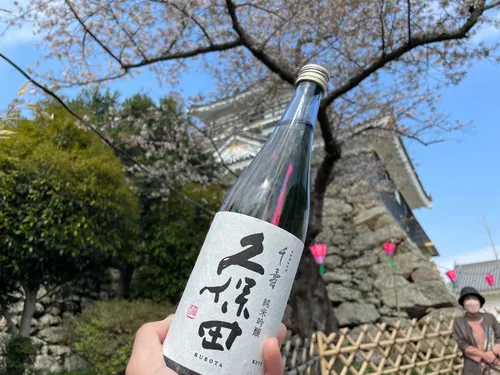

<route lang="yaml">
meta:
    title: お花見2023をしました！
    postedAt: 2023-04-03
    lastUpdatedAt: 2023-04-25
    eyecatch: /eyecatch/castle-with-sakura.webp
    description:
        今年も SZPP 恒例のお花見をしてきました。桜の下で寿司を食べたり、競プロしたりしました！
</route>

4月3日、今年も SZPP 恒例のお花見をしてきました！

昨年はお花見のタイミングを逃してしまい、満開の桜 (白目) の下での競プロとなってしまいました。 \
▼昨年のお花見のツイート：

<blockquote class="twitter-tweet">
今日はサークルのメンバーと一緒に「お花見バチャ」をしてきました！咲き誇る桜の花を見ながら行うバチャは至高のバチャでした！！！ <a href="https://t.co/81WsfQ7mI6">pic.twitter.com/81WsfQ7mI6</a>
&mdash; 静岡大学プログラミングサークル SZPP【同好会】 (@szpp_3776) <a href="https://twitter.com/szpp_3776/status/1512036529912565763?ref_src=twsrc%5Etfw">April 7, 2022</a></blockquote>

今年はその反省を活かして、ちょうど良い時期にお花見ができました。
桜の下で仲良く食べるお寿司やおつまみは絶品でした！

<figure>
    
    <figcaption>お城と桜をバックにかがやく日本酒</figcaption>
</figure>

もちろん毎年恒例のお花見競プロもしました！

<blockquote class="twitter-tweet">
Q. プログラミングサークルで花見するとどうなる？ A. こうなる <a href="https://t.co/b6jNOTTk2b">pic.twitter.com/b6jNOTTk2b</a>
&mdash; arkw (@arkw0) <a href="https://twitter.com/arkw0/status/1642773060607676417?ref_src=twsrc%5Etfw">April 3, 2023</a></blockquote>

